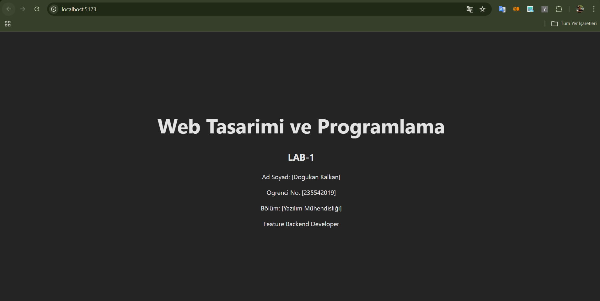

📌 Web Lab Hello
👤 Öğrenci Bilgileri

Ad Soyad: Doğukan Kalkan

Öğrenci No: 235542019

📖 Proje Hakkında

Bu proje, web geliştirme laboratuvarı kapsamında oluşturulmuştur.
Temel amaç:

Basit bir web uygulaması geliştirmek

Git ve GitHub kullanımını öğrenmek

Branch mantığını uygulamak

Versiyon kontrol sistemi pratiği yapmak

🛠 Kullanılan Teknolojiler

HTML

CSS

JavaScript

Git

GitHub

🌿 Branch Yapısı

Projede aşağıdaki branch yapısı kullanılmıştır:

master → Ana proje branch'i

feature/personalize-ui → Arayüz kişiselleştirme çalışmaları

🚀 Projeyi Çalıştırma

# 1. Repoyu klonla
git clone <repo-link>

# 2. Klasöre gir
cd web-lab-hello

# 3. Bağımlılıkları yükle
npm install

# 4. Development server başlat
npm run dev

## Ekran Goruntusu
