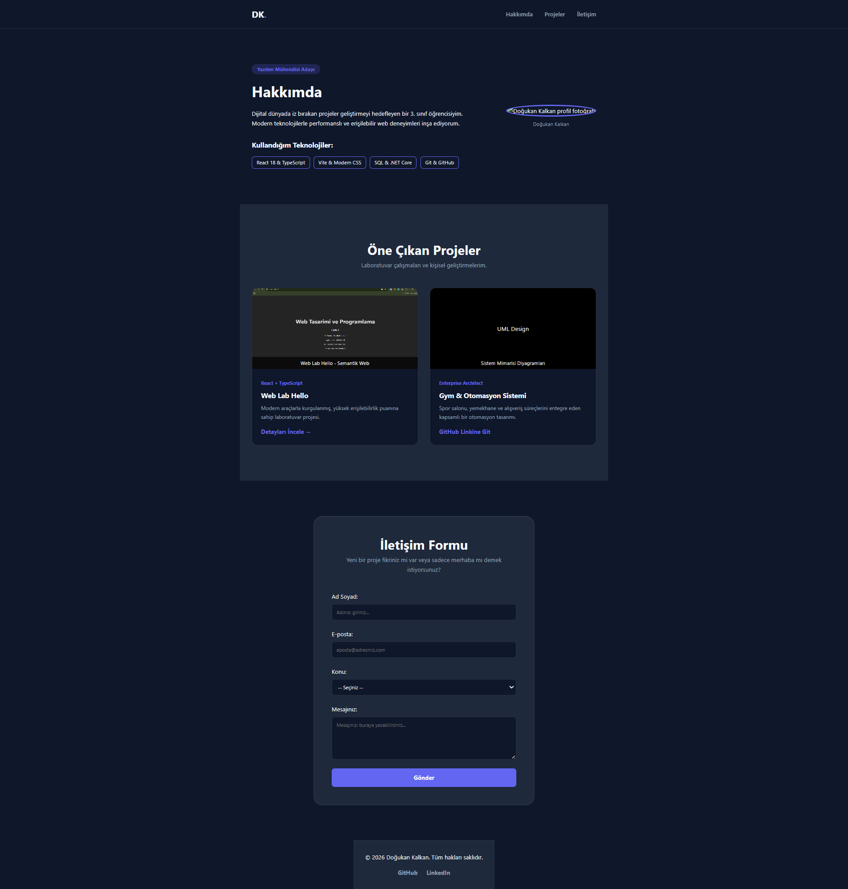
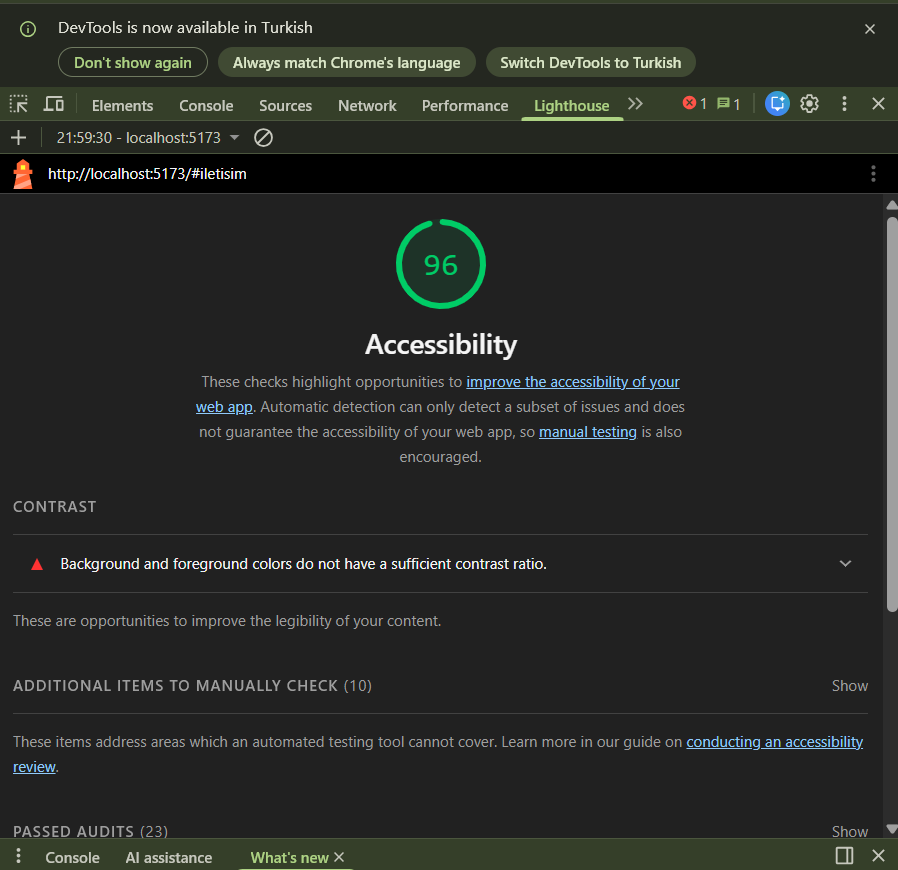

u proje, Web Geliştirme Laboratuvarı kapsamında **Semantik HTML5**, **Erişilebilirlik (a11y)** ve modern tasarım prensipleri dikkate alınarak geliştirilmiş bir kişisel portfolyo web uygulamasıdır.

---

## 👤 Geliştirici Bilgileri

* **Ad Soyad:** Doğukan Kalkan
* **Öğrenci No:** 235542019
* **Bölüm:** Yazılım Mühendisliği (3. Sınıf)

---

## ✨ Öne Çıkan Özellikler

* **Semantik Yapı:** `<header>`, `<main>`, `<section>`, `<article>`, `<figure>` ve `<figcaption>` gibi doğru HTML5 etiket hiyerarşisi.
* **Erişilebilirlik (a11y):** Ekran okuyucular ve klavye gezintisi için `aria-label`, doğru başlık hiyerarşisi (H1-H3) ve "Ana içeriğe atla" (skip-link) butonu.
* **Doğrulamalı İletişim Formu:** HTML5 validasyon kurallarına (required, minLength, type="email") uygun çalışan, dinamik hata mesajlı form yapısı.
* **Modern UI:** Responsive (mobil uyumlu), cihaz boyutlarına göre esneyen grid sistemi ve modern dark mode arayüz.

---

## 🛠 Kullanılan Teknolojiler

* **React 18**
* **TypeScript**
* **Vite**
* **Saf CSS** (Flexbox, CSS Grid, Custom Variables)

---

## 🚀 Projeyi Çalıştırma

Projeyi yerel ortamınızda çalıştırmak için aşağıdaki komutları sırasıyla terminalinizde çalıştırın:

```bash
# Repoyu klonlayın
git clone <repo-link>

# Proje dizinine girin
cd web-lab-hello

# Bağımlılıkları yükleyin
npm install

# Geliştirme sunucusunu başlatın
npm run dev
```

#Web Sitesi Ekran Görüntüsü


#LightHouse Ekran Görüntüsü

