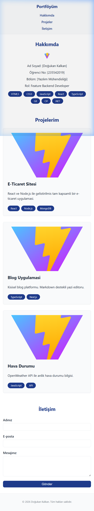
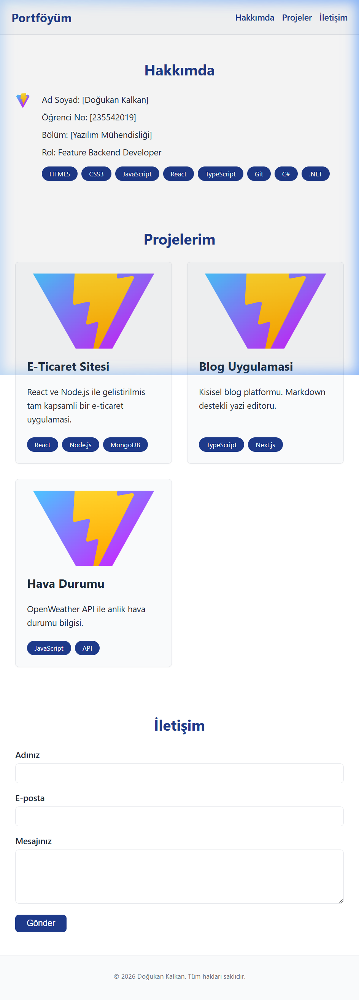
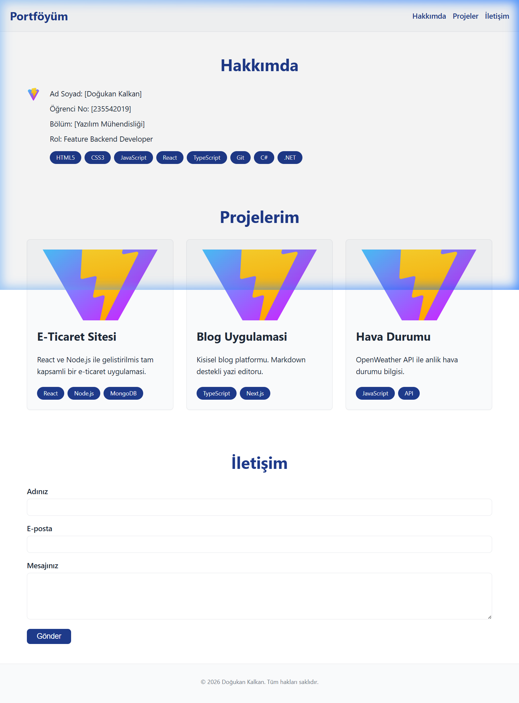

# 🌐 Web Tasarımı ve Programlama — LAB-3

Bu proje, **Web Geliştirme Laboratuvarı LAB-3** kapsamında; CSS Design Tokens, Fluid Typography, Flexbox, CSS Grid ve Mobile-First Responsive Design konularını uygulamak amacıyla geliştirilmiştir.

---

## 👤 Öğrenci Bilgileri

| Bilgi | Detay |
| :--- | :--- |
| **Ad Soyad** | Doğukan Kalkan |
| **Öğrenci No** | 235542019 |
| **Bölüm** | Yazılım Mühendisliği |

---

## 📖 Proje Hakkında

Bu projede aşağıdaki konular uygulamalı olarak gerçekleştirilmiştir:

* ✅ **Design Tokens** — `src/styles/tokens.css` dosyasında `:root` içinde CSS değişkenleri (renk, boşluk, font, gölge)
* ✅ **Fluid Typography** — `clamp()` fonksiyonu ile media query yazmadan duyarlı font boyutları
* ✅ **Flexbox Navigasyon** — Mobilde dikey, tablette yatay responsive header & nav
* ✅ **CSS Grid Proje Kartları** — Mobilde 1 sütun → Tablette 2 → Masaüstünde 3 sütun
* ✅ **Mobile-First yaklaşım** — Tüm stiller küçük ekrandan büyüğe doğru `min-width` ile genişliyor
* ✅ **Beceri Etiketleri (Toolbar)** — `flex-wrap` ile sarmalanan etiket listesi
* ✅ **İletişim Formu** — Responsive, erişilebilir form yapısı
* ✅ **Focus / A11y** — `:focus-visible` ile tab gezinme korunuyor

---

## 🛠 Kullanılan Teknolojiler

* React 18
* TypeScript
* Vite
* Vanilla CSS (Design Tokens + Flexbox + Grid)

---

## 🌿 Branch Yapısı

* **main** — Projenin ana ve stabil versiyonu
* **feature/lab3-responsive-layout** — LAB-3 responsive tasarım çalışmaları

---

## 📸 Ekran Görüntüleri

### 📱 Mobil (375px)


### 📟 Tablet (768px)


### 🖥️ Masaüstü (1280px)


---

## 🚀 Projeyi Çalıştırma

1. Repoyu klonlayın:
```bash
git clone https://github.com/Dogukan-klkn/web-lab-hello.git
```

2. LAB-3 branchine geçin:
```bash
git checkout feature/lab3-responsive-layout
```

3. Bağımlılıkları yükleyin:
```bash
npm install
```

4. Geliştirme sunucusunu başlatın:
```bash
npm run dev
```

---

## � Proje Yapısı

```
src/
├── styles/
│   └── tokens.css        # CSS Design Tokens (:root değişkenleri)
├── App.tsx               # Ana bileşen (Header, Hakkımda, Projeler, İletişim)
├── App.css               # Responsive layout stilleri (Mobile-First)
├── index.css             # Global reset ve temel stiller
└── main.tsx              # Uygulama giriş noktası
screenshots/
├── screenshot-mobile.png
├── screenshot-tablet.png
└── screenshot-desktop.png
CSS-KARARLARI.md          # CSS tasarım kararları notu
```

---

*Bu proje Doğukan Kalkan tarafından eğitim amaçlı hazırlanmıştır.*